This Data Build Tool (DBT) Continuous Integration, Continuous Delivery (CI/CD) project was created as supplementary project for the Microsoft Fabric Insurance Project which can be found [here](https://github.com/salano/MS-Fabric-End-to-End-Insurance-Project)

We created a DBT project to validate and transform the data for the silver and gold layers in medallion architecture of the Microsoft Fabric project. It uses the Slowly Changing Dimensio (SCD) type data modelling technique to model the dimension tables in this layer.

We will use Microsoft Azure Service Principal to connect to our Warehouse in Microsoft Fabric.

We assume you have a Microsoft Azure Service Principal Account added as a Member/Contributor role in the Microsoft Fabric workspace.

In the DBT project we do the following:

- Update the statistics on gold layer tables after DBT builds
- Create SCD type 2 modelling for the customers and policies snapshots
- Create a Incremental claims and master data models
- Create views for the polices and customers data in the gold layer
- Validation:
  - Schema validation enforced with DBT contracts
  - Apply unique constrainst to key columns
  - Apply not null constrainst to key columns
  - Apply accepted values constrainst selected fields - status, gender etc
  - Apply relationship constraints between the tables
  - Test money value fields have values greater than 0
  - Test string values are not empty
  - Test date fields have no future date values
- Linting test

The DBT project:

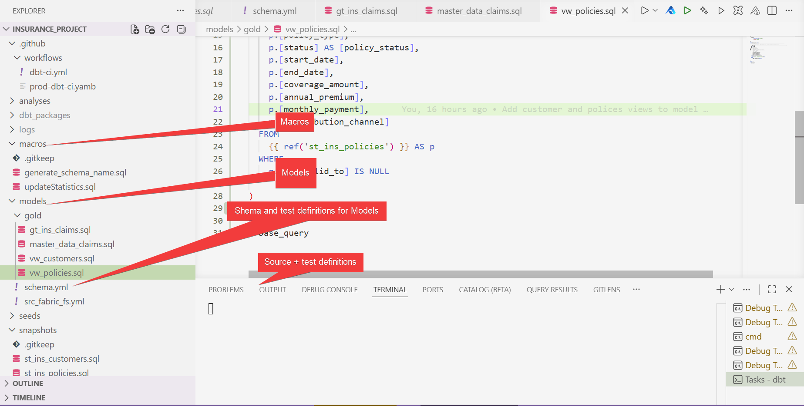

We want to create a basic CI pipeline in GitHub to run tests and build the project. This will ensure we are using tested DBT project in Microsoft Fabric.
We will perform the followin in the pipeline

1. SQL linting (we use [sqlfluff](https://www.sqlfluff.com/))
2. dbt testing
3. dbt build/run (Slim CI)

> Sqlfluff installation

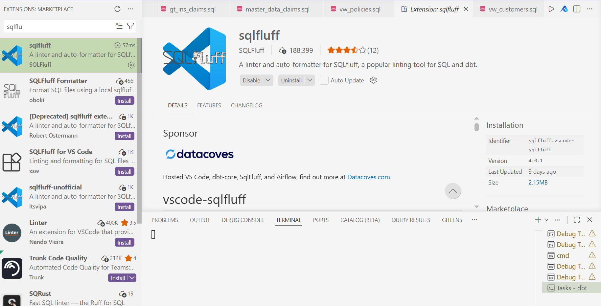

> Sqlfuff configuration

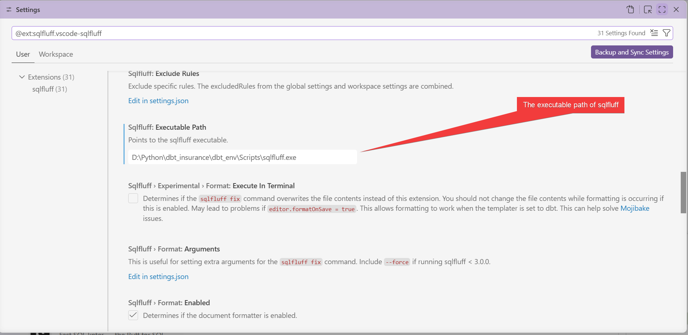

The CI/CD Pipeline

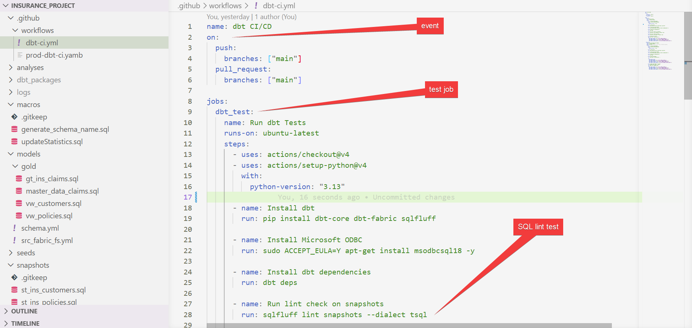
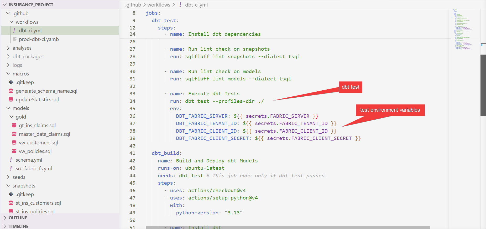
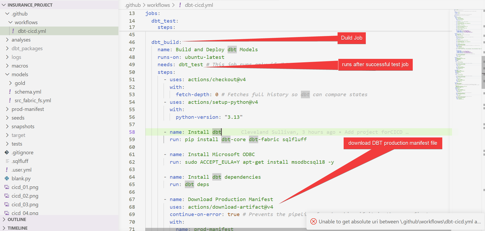
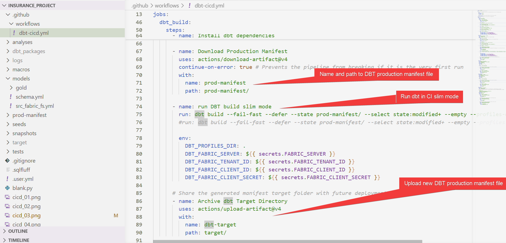
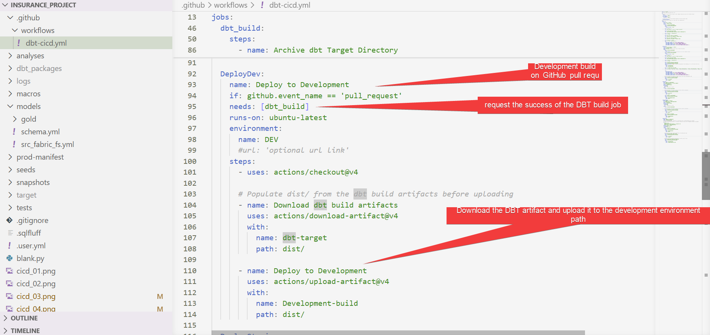
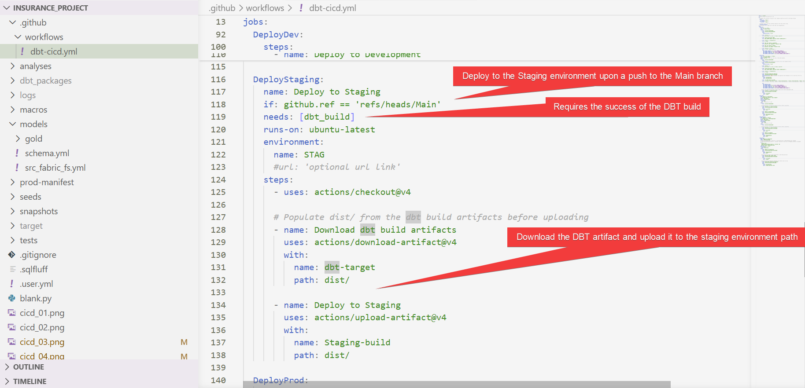
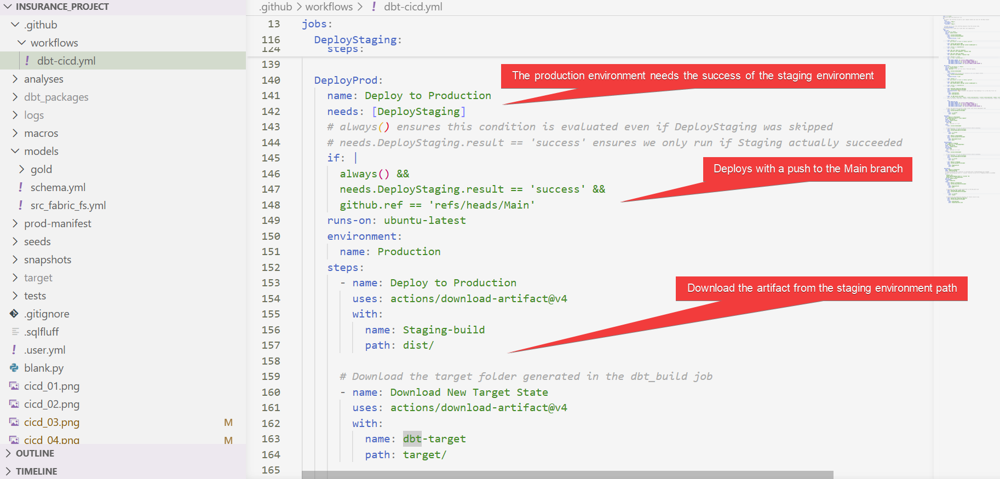
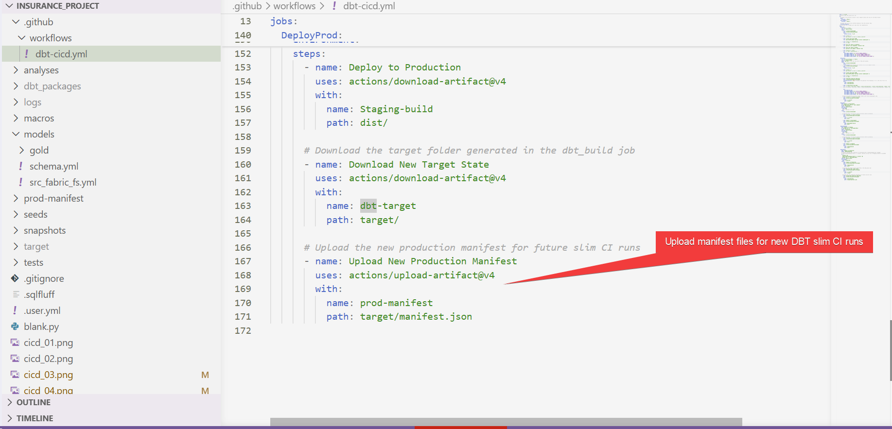

In Github, we add environments for development, staging/testing/QA, and production. Each representing the stages of our Continuous Integration, Continuous Delivery pipeline.

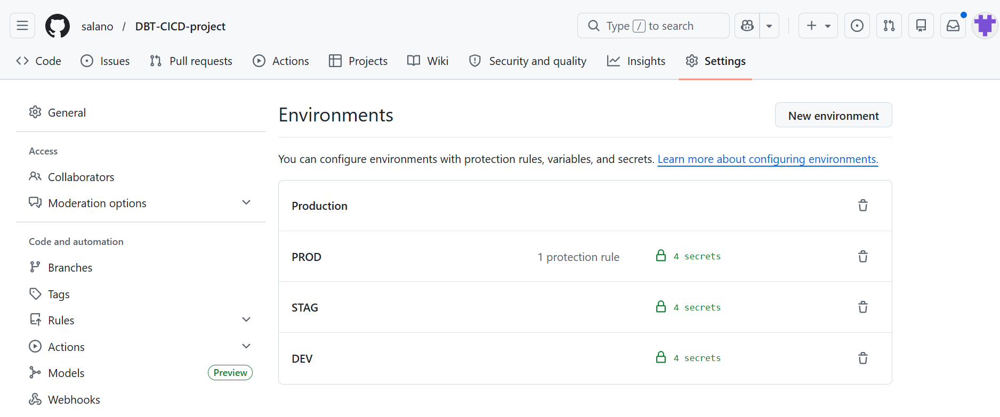

We set up environment secrets for each environment. These will take precedents over the repository secrets for each environment and should be specific to the environment.

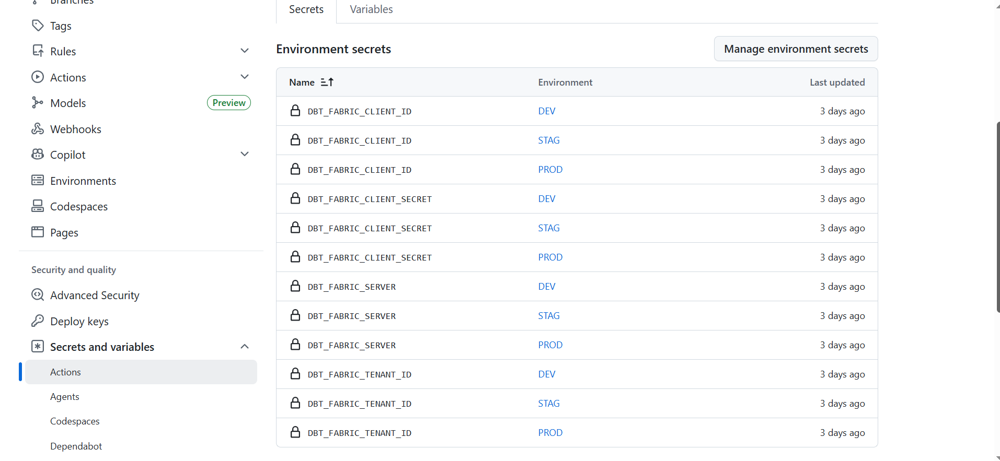

We set the repository secret variables to execute the GitHub runner.

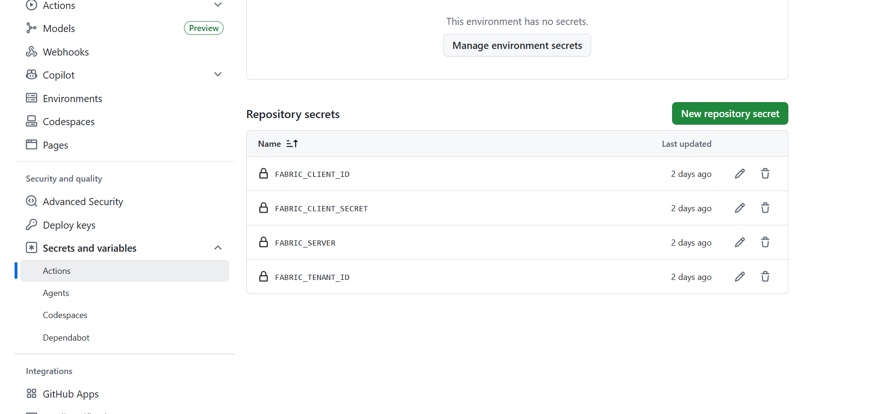

On push to main branch. We can see the logs

After, the DBT tests and build jobs, we progress to the staging and then the production environments. Ideally, we should protect the production environment and add the appropiate reviewers in a production environment.

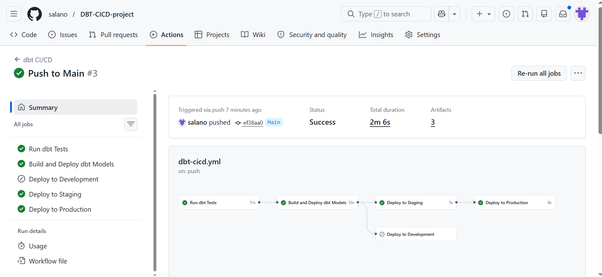
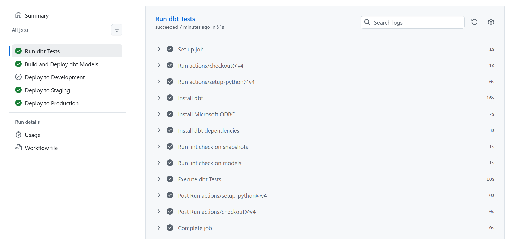
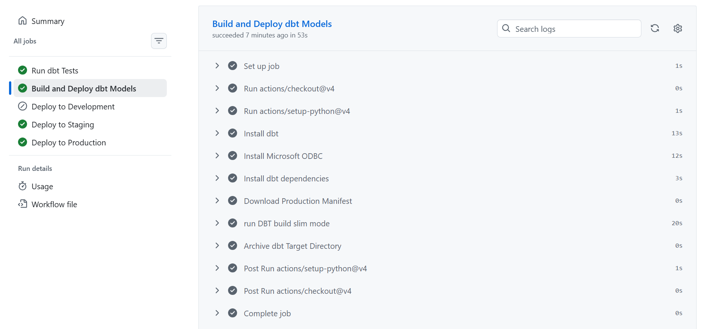

On a merge to main branch from a feature branch pull request. We can see the logs
After, the DBT tests and build jobs, we progress to the developement environment for code merging and review.

Create a feature branch and create a pull request

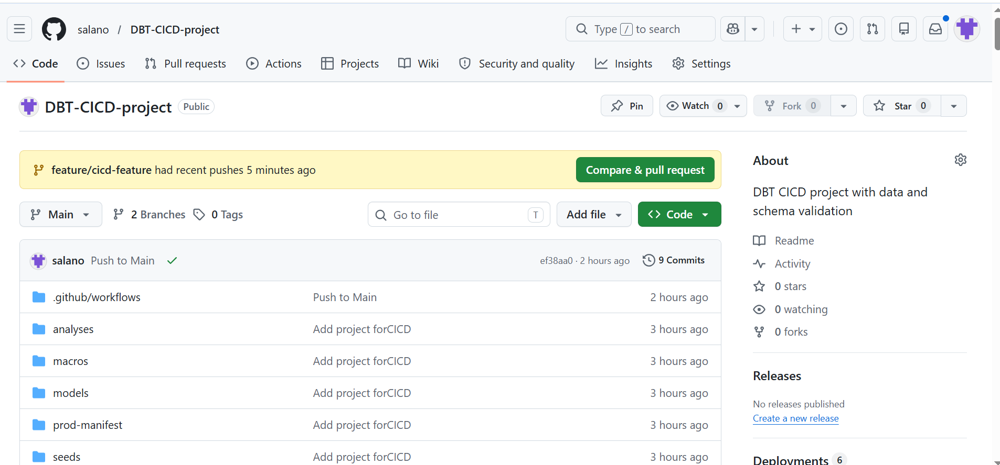
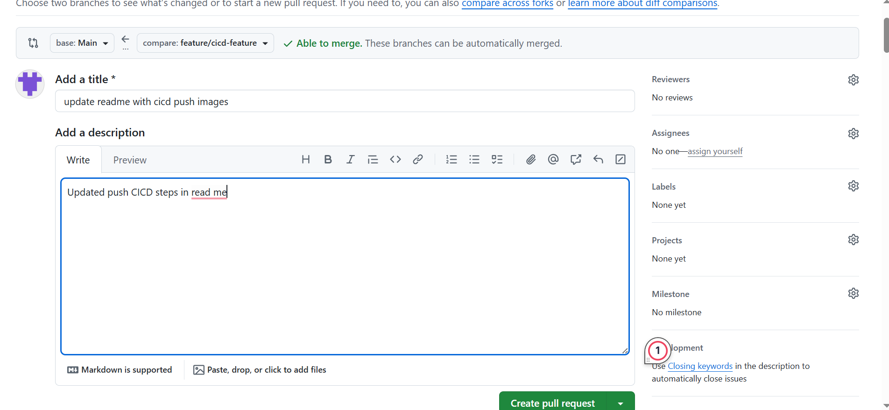

After successfully merging the feature branch into the main branch triggers a deployment to the staging environment.

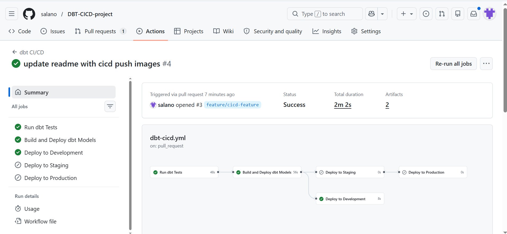
